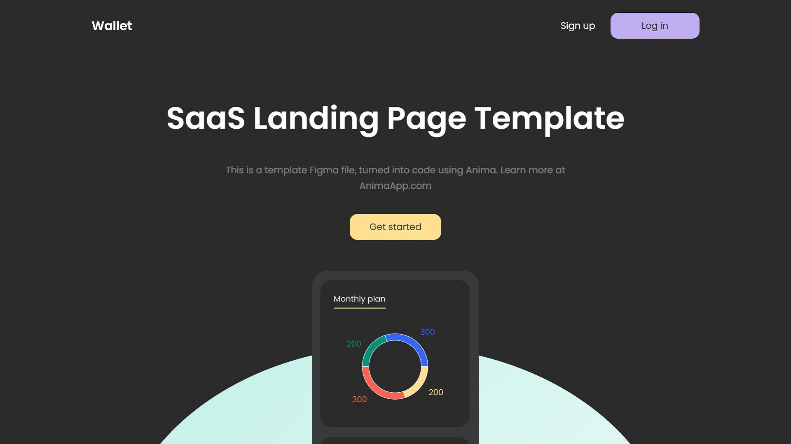

# Wallet Landing Page

This is a responsive landing page built using HTML and CSS based on a Figma design.

## 📚 Project Features
- Semantic and clean HTML markup
- Modern CSS techniques (Flexbox, responsive design)
- BEM methodology used for scalable structure
- Fully responsive layout for all devices
- Cross-browser compatible
- Smooth animations and UI interactions
- Optimized for performance and fast loading

## 📖 Live Demo
https://otomje.github.io/wallet/

## 📕 Links
- [Figma mockup](https://www.figma.com/community/file/1091046863319888542/saas-landing-page-template-landing-page-template-ready-to-export-to-html-landing-page-for-saas)

---

